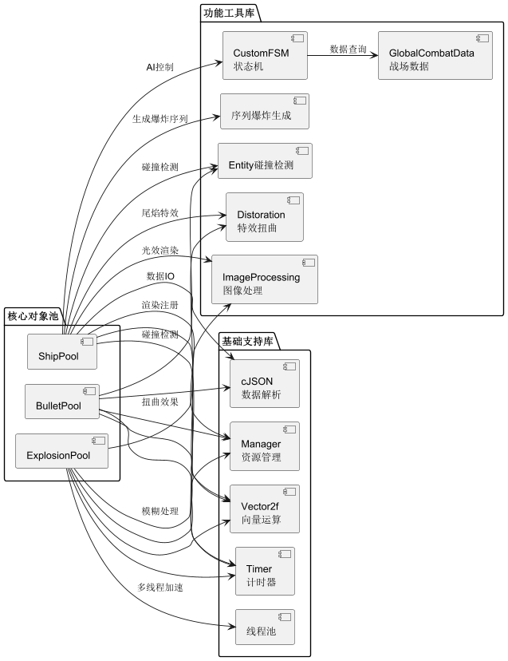

# Starsector Nano

一个使用C语言和EasyX图形库开发的2D太空飞船对战游戏，灵感来源于Starsector。这是C语言课程设计项目。



## 🎮 快速开始

### 构建与运行
```bash
# 克隆项目
git clone https://github.com/yourusername/starsector-nano.git
cd starsector-nano

# 构建项目
mkdir build && cd build
cmake .. && cmake --build .

# 运行游戏
./starsector-nano.exe
```

### 游戏控制
- **WASD**：飞船移动
- **鼠标左键**：开火
- **鼠标滚轮**：摄像机缩放
- **鼠标拖动**：摄像机平移

## 📚 详细文档

- [📖 架构设计](docs/architecture.md) - 项目结构和模块设计
- [🚀 物理系统](docs/physics_system.md) - 运动、碰撞和物理模拟实现
- [🎯 碰撞检测](docs/sat_collision.md) - SAT算法实现细节
- [🎨 图形特效](docs/easyx_effects.md) - EasyX特效实现原理
- [🛠️ 开发指南](docs/development.md) - 如何添加新内容和修改游戏

## 🚀 项目特色

### 核心技术
- **纯C语言实现**：不使用游戏引擎，从零构建
- **对象池系统**：高效管理飞船、子弹、爆炸效果
- **有限状态机AI**：智能敌人行为系统
- **多线程渲染**：线程池处理爆炸效果
- **物理碰撞系统**：多边形碰撞检测和响应

### 游戏特性
- **真实的太空物理**：动量、惯性、转向阻尼
- **模块化武器系统**：激光、子弹、导弹不同类型
- **战术地图系统**：实时战场态势显示
- **资源管理系统**：JSON/CSV配置驱动的内容管理

## 📁 项目结构

```
starsector-nano/
├── docs/                   # 详细文档
├── src/                    # 源代码
├── include/                # 头文件
├── assets/                 # 游戏资源
├── easyx/                  # EasyX图形库
├── json-3.11.3/            # JSON解析库
├── CMakeLists.txt          # CMake构建配置
├── README.md               # 项目说明
└── LICENSE                 # MIT许可证
```

## 📄 许可证

MIT License - 查看 [LICENSE](LICENSE) 文件了解详情。

---

**一个完整的C语言游戏开发实践项目，适合学习和参考！**